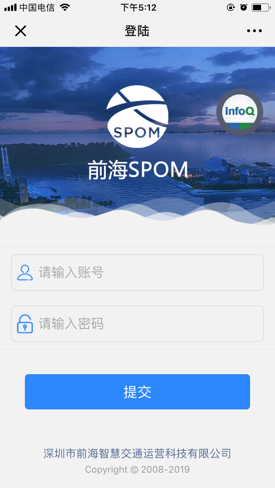
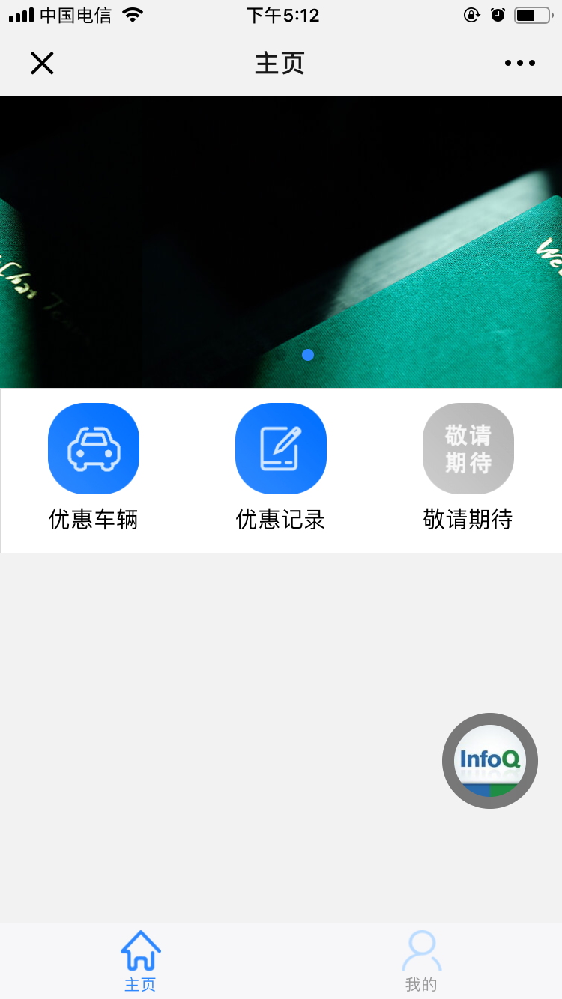
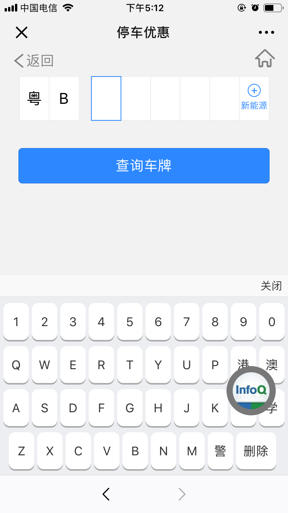
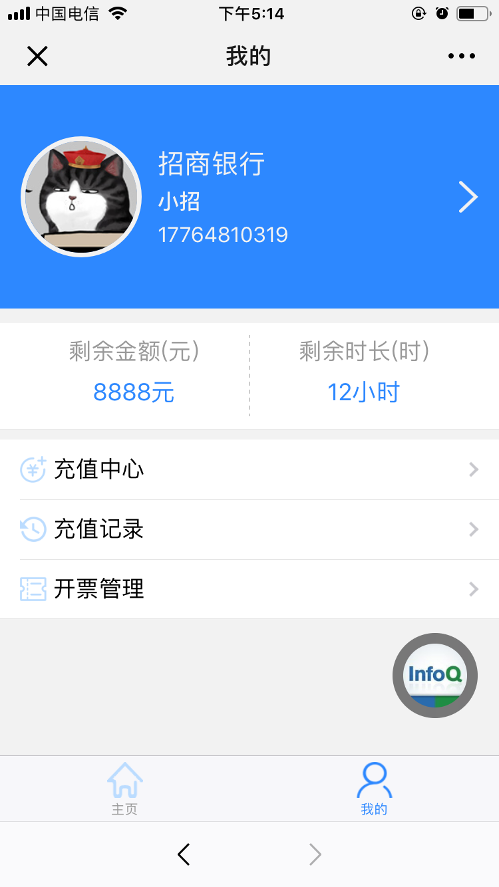

登陆页面：https://asazws.github.io/Merchant-activity/login.html  
主页面：https://asazws.github.io/Merchant-activity/index.html

# 商家停车优惠及停车电子发票逻辑页面

本例子面基于WeUi，包含优惠车辆、优惠记录、车牌电子键盘、选择优惠方式、个人页面、钱包充值、电子发票等页面

部分截图：

